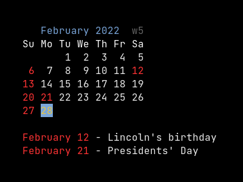
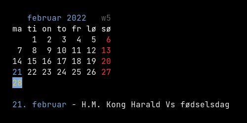
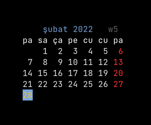

# Kal  

Package for finding public holidays, easter, notable days, equinoxes, solstices and flag flying days. Deals with dates and intervals between dates.

## Online API documentation

* [godoc.org](http://godoc.org/github.com/xyproto/kal)

## Features and limitations

* Provides a collection of functions for dealing with dates, intervals between dates and special days like winter solstice.
* Provides functions for finding public holidays ("red days"), easter, notable days, equinoxes, solstices and flag flying days, for some calendars (every country may have different flag flying days).
* Currently, public holidays and flag flying days have only been implemented for USA, Norway and Turkey, but pull requests are welcome!

## Kal utility

### Screenshots

#### en_US

#### nb_NO

#### tr_TR

### Installation

With Go 1.17 or later:

    go install github.com/xyproto/kal/cmd/kal@latest

## General information

* Version: 1.3.0
* License: BSD-3
* Author: Alexander F. Rødseth &lt;xyproto@archlinux.org&gt;
